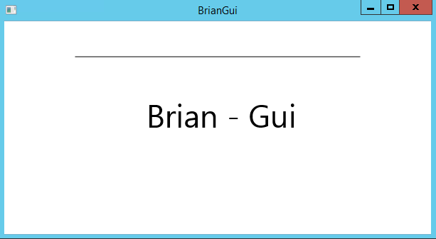
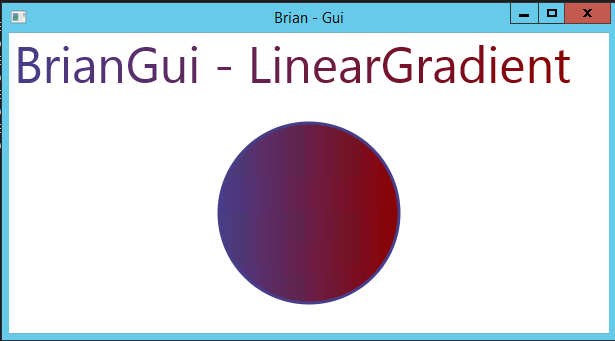

# JavaFX

Fonte: tutorialspoint/javafx/index.htm

## Aplicativo

### Principais classes da API

* **javafx.animation** - Contém classes para adicionar animações baseadas em transição, como preenchimento, esmaecimento, rotação, escala e translação.
* **javafx.application** - Contém um conjunto de classes responsáveis pelo ciclo de vida do aplicativo JavaFX
* **javafx.css** - Contém classes para adicionar estilos semelhantes a CSS a aplicativos JavaFX
* **javafx.event** - Contém classes e interfaces para entregar e manipular eventos JavaFX
* **javafx.geometry** - Contém classes para definir objetos 2d e executar operações neles.
* **javafx.stage** - Contém classes de contêiner de nível superior para o aplicativo JavaFX.
* **javafx.scene** - Contém classes e interfaces para suportar o grafo de cena. Além disso, também fornece subpacotes como canvas, chart, control, effect, image, input, layout, media, paint, shape, text, transform, web, ....


### Scene Graph

O **scene graph** é o ponto de partida de uma aplicação JavaFX, ele contém todos os nós, que nada mais sao do que objetos visuais que podem incluir:

* **Objetos geométricos (gráficos)** - 2 e 3D, como círculos, retângulos, etc.
* **Controles de UI** - Button, Checkbox, Choice box, etc.
* **Contêiners** - painéis de layout, como painel de borda, painel de grade, painel de fluxo, etc.
* **Elementos de mídia** - como objetos de áudio, video, e imagem.

Uma coleção de nós gera um **scene graph**.


Cada **node** possui somente um pai, e aquele que não pai, chamamos de **root node**. O **node** que não possui filho chamamos de **lead node**, já o que possui filho é o **branch node**. Cada **node** é único em um **scene graph** e suas propriedades podem ser manipuladas.

### Prism

É um **pipeline** gráfico acelerador por hardrware de alto desempenho que usar:

* DirectX 9 no Windows XP e Vista.
* DirectX 11 no Windows 7.
* OpenGL no Mac e Linux.

Quando o sistema possuí gráficos integrados, os gráficos são mais suaves, quando não existir ele usará renderização por software.

### GWT (Glass Windowing Toolkit)

Fornece serviço para gerenciamento de janelas, temporizadore, superfícies e filas de evento. É ele que conecta a plataforma ao simtema operacional.

### Quantum Toolkit

É a abstração de baixo nível dos componentes gráficos que os deixa disponíveis ao JavaFX.

### WebView

Com a tecnólogia **Web Kit** possibilita a incorporação ed conteúto HTML ao **scene graph**. Suporta tecnologias como: HTML5, CSS, JavaScript, DOM e SVG. As possibilidades são muitas, dentre elas destacamos:

* Renderizar conteúdo HTML de URL local ou remota.
* Histórico de suporte e fornecer navegação para frente e para trás.
* Recarregar o conteúdo.
* Aplicar efeito aos componentes da web.
* Editar conteúdo HTML.
* Executar comando JavaScript.
* Lidar com eventos.

### Media Engine

O **media engine** é baseado no mecanismo de reprodução de conteúdo de áucio e vídeo **Streamer** que da suporte à: **MP3, WAV, AIFF e FLV**. Quem cuida disso éa biblioteca `javafx.scene.media`. Ela fornece os componentes:

* **Media Object** - Representa um arquivo de midia.
* **Media Player** - Reproduz o conteúdo de midia.
* **Media View** - Exibe a midia.

### Estrutura Do Aplicativo JavaFX

Em geral, o aplicativo JavaFX possui os componente: **Stage, Scene e Scene Graph**.


#### Stage

É nela que encontramos todos os objetos do aplicativo, seria uma janela. É representada pela classe **Stage** do pacote `javafx.stage`. O primeiro **stage** é criado pela plataforma. O método `start()` da classe **Application** recebe um objeto **stage**. O **stage** possui dois parâmetros para posição **Width e Height**, dividi-se em *Área De Conteúdo e Decorações (Barra De Título e Bordas)*.

Os **stages** são:

* Decorated
* Undecorated
* Transparent
* Unified
* Utitlity

Seu conteúdo pode ser exibido chamando `show()`.

#### Scene

Representa o conteúdo do aplicativo. A clase **Scene** faz parte do pacote `javafx.scene`, é ele que é adicionado a um estágio. Também podemo definir o seu tamanho, bem como o **root node** na hora de intânciar a classe.

#### Scene Graph e Nodes

O **scene graph** é uma estrutura no formato de árvore que representa o conteúdo de uma **scene**, os **nodes** são os objetos visial de um **scene graph**. Já comentamos os tipos de [**nodes**](#scene-graph), e um pouco sobre os tipos, que irei reforçar e complementar aqui.

* **root node** - Primeiro **node** do **scene graph**
* **branch node/Parente node** - **node** que não possui pai. A classe **Parent** do pacote `javafx.scene` e a geradora dos pais, que podem ser do seguinte tipo:
  * **Group** - Lista de nós filhos, sempre que é renderizado, os filhos tamém o são, em ordem. Qualquer efeito aplicado ao grupo será aplicado a todos os filhos.
  * **Region** - Base dos controle de interface baseados em *JavaFX Node -> Chart, Pane e Control*
  * **WebView** - Gerencia o mecânismo que trabalho com conteúdo web
* **leaf node** - Aquele que não possui filho, exemplo: *Rectangle, Ellipse, Box, ImageVies, MediaView etc*

### Primeiro contado com JavaFX

Primeiro devemos sobrescrever o método abstrato `start()` da classe **Application** que é a porteira do brinquedo. Essa classe deve ser herdada em nossa classe principal.

No método `main()` iniciaremos o aplicativo chamando `launch()`, esse método é encarregado de chamar o `start()`.

```java
/**
 * JavaFX App
 */
public class App extends Application {

    private static Scene scene;

    @Override
    public void start(Stage stage) throws IOException {
       /*
        * Stage, Scene, Scene Graph
       */
    }   

    public static void main(String[] args) {
        launch();
    }

}
```

Dentro de `start()`, precisaremos seguir às seguinte etapas:

* Criar um **scene graph** com seus **nodes**.
* Criar uma **scene** com a dimensões desejadas e passar o **root node**.
* Criar um **stage**, adicionar a **scene** e mostrar o conteúdo do **stage**.

#### Preparando o Scene Graph

Primeiro deveremos criar um **root node**, para isso poderemos escolher um entre *Grupo, Region ou WebView*.

**Group** - É representado pela chamada **Group** do pacota `javafx.scene`.

```java
Grup root = new Group();
```

O método `getChildren()` retorna um **ObservableList** que contém os **nodes**. É nele que adicionaremos nossos **nodes**.

```java
Observable list = root.getChildre();

list.add(NodeObject);
```

Também é possível passar um **node** na criação do objeto **Group**.

**Region** - Classe base para controle de interface como:

* **Chart** - Classe base do gráfico, pertence ao pacote `javafx.scene.chart`. Possui as subclasses **PieChart** e **XYChart**, que por sua vez possuem sobclasses como **AreaChart, BarChart, BubleChart etc**
* **Pane** - Clase base dos painéis, como **AchorPane, BoderPane, DialogPane etc**. Elas são encontradas no pacote `javafx.scene.layout`.
* **Control** - Classe base dos controle de interface, como **Accordion, ButtonBar, ChoiceBox, ComboBoxBase, HTMLEditor etc**. Elas ão encontradas no pacot `javafx.scene.control`.

Cada uma dessas classes podem ser usadas como nós raiz.

```java
StackPane pane = new StackPane();

ObservableList list = pane.getChildren();
list.add(NodeObject)
```

**WebView** - Gerencia a exibição do conteúdo web.

Uma breve imagem sobre:


#### Preparando a Scene

O pacote `javafx.scene` possui a classe **Scene**, sua instância representa uma **scene**. Quando criamo o objeto é obrigatório passar o **root node**.

```java
Scene scene = new Scene(root);
```

Também podemos definir o tamanho da **scene**, para isso:

```java
Scene scene = new Scene(roo, 600, 300);
```

#### Preparando o **Stage**

Todo aplicativo deve conter esse contêiner, pois é ele que fornece uma janela a ele. É uma instância da classe **Stage** do pacote `javafx.stage`. Um objeto dessa classe é passado como parâmetro para o método `start()` da classe **Application**.

Podemos executar algumas ações com o objeto **stage**:

* Definir o título com `setTitle()`.
* Adicionar a **scene** no **stage** com `setScene()`.
* Exibir o seu conteúdo com `show()`.

```java
primaryStage.setTitle("Olá Mundo");

primaryStage.setScene(scene);

primaryStage.show();
```

### Ciclo de vida do aplicativo

Os método do siclo de vida são:

* `start()` - Método do ponto de entrada onde o código gráfico deve ser escrito
* `stop()` - Lógica para parar o aplicativo.
* `init()` - Pode ser criado um **stage** ou **scene** nele.

Além desses temos o método estático `launch()` que inicia o aplicativo. Quando o chamamos acontece o que se segue:

* É criado uma intÂncia da clesse do aplicativo.
* O método `init()` é chamado.
* O método `start()` é chamado.
* Espera o aplicativo fechar e chama o método `stop()`.

### Encerrando o aplicativo

O aplicativo é encerrado implicitamente quando a última janela for fechada, esse comportamento pode ser alterado passando `false` ao método estático `setImplicitExit()`.

Para encerrar implicitamento basta usar: `Plataform.exit()` ou `System.exit(init)`.

### Exemplo 1 - Criando Uma Janela Vazia

Mãos na massa.

#### E1 - Passo 1

Criar uma classe que herde de **Application** e implemente o método `start()`

```java
public class App extends Application{

    @Override
    public void start(Stage primaryStage) throws Exception {
    }   
}
```

#### E1 - Passo 2

Criando um objeto **Group** dentro do método `start()`.

```java
public class TesteAplicativoJanelaVazia extends Application{

    @Override
    public void start(Stage primaryStage) throws Exception {
        Group root = new Group();
    }
}
```

#### E1 - Passo 3

Criando um objeto **Scene** que receberá nosso *root* e as dimensões da tela.

```java
public class TesteAplicativoJanelaVazia extends Application{

    @Override
    public void start(Stage primaryStage) throws Exception {
        Group root = new Group();
        Scene scene = new Scene(root, 600, 300);
    }
}
```

#### E1 - Passo 4

Definindo um título usando `setTitle()` da clase **Stage**. A instância dessa classe é representada pelo objeto `primaryStage`.

```java
public class TesteAplicativoJanelaVazia extends Application{

    @Override
    public void start(Stage primaryStage) throws Exception {
        Group root = new Group();
        Scene scene = new Scene(root, 600, 300);

        primaryStage.setTitle("BrianGui");
    }
}
```

#### E1 - Passo 5

Adicionando o objeto **Scene** ao **Stage** com `setScene()`.

```java
public class TesteAplicativoJanelaVazia extends Application{

    @Override
    public void start(Stage primaryStage) throws Exception {
        Group root = new Group();
        Scene scene = new Scene(root, 600, 300);

        primaryStage.setTitle("BrianGui");
        primaryStage.setScene(scene);
    }
}
```

#### E1 - Passo 6

Usar o método `show()` do objeto **Stage** para mostrar o conteúdo.

```java
public class TesteAplicativoJanelaVazia extends Application{

    @Override
    public void start(Stage primaryStage) throws Exception {
        Group root = new Group();
        Scene scene = new Scene(root, 600, 300);

        primaryStage.setTitle("BrianGui");
        primaryStage.setScene(scene);
        primaryStage.show();
    }
}
```

#### E1 - Passo 7

Iniciando o aplicativo com `launch()`, faremos isso dentro do método estático `main`.

```java
public class TesteAplicativoJanelaVazia extends Application{

    @Override
    public void start(Stage primaryStage) throws Exception {
        Group root = new Group();
        Scene scene = new Scene(root, 600, 300);

        primaryStage.setTitle("BrianGui");
        primaryStage.setScene(scene);
        primaryStage.show();
    }

    public static void main(String[] args) {
        launch(args);
    }
}
```

### Exemplo 2 - Desenhar uma linha reta

Aproveitando o que já foi criado, iremos incluir uma linha reta.

#### E2 - Criando uma linha

A linha é criada a partir da intância da classe **Line** do pacote `javafx.scene.shape`.

```java
//Criando a linha
Line line = new Line();
```

#### E2 - Definindo a propriedades da linha

A coordenadas da linha são configuradas com os métodos `startX()`, `startY()`, `endX()` e `endY()`.

```java
//Coordenadas da linha
line.setStartX(100.0);
line.setStartY(150.00);
line.setEndX(500.0);
line.setEndY(150.0);
```

#### E2 - Inserimos nossa linha no grupo

Inserindo a linha no grupo.

```java
//Criando o grupo e passando a linha como parâmetro
Group root = new Group(line);
```

#### E2 - Resultado


### Exemplo 3 - Exibindo Texto

Vamos fazer o mesmo do que com o exemplo dois, porém com um objeto do tipo `Text`.

#### E3 - Incorporando Texto

Os objetos que representam um texto no aplicação são instâncias da classe **Text** do pacote `javafx.scene.text`. Ao criar o objeto podemos passar ou não o texto que ele deverá ter.

```java
//Criando o objeto texto
Text text = new Text();
```

#### E3 - Configurando a Fonte

O método `setFont()` recebe um objeto do tipo **Font** como parâmetro. Esse objeto pode controlar todo o estilo da fonte que iremos utilizar, por hora, vamos altera o tamanho.

```java
//Configurando o tamanho da fonte
text.setFont(new Font(45));
```

#### E3 - Definindo a posição do objeto

Usaremos o mesmo padrão de coordenadas da linha, o plano XY. Aqui definiremos o vértice inicial.

```java
//Coordenadas do vertice inical
text.setX(200);
text.setY(150);
```

#### E3 - Definindo o texto que será apresentado

Utilizando o método `setText()`, podemos indicar à aplicação qual o texto que deverá ser renderizado.

```java
//Definindo o texto
text.setText("Brian - Gui");
```

#### E3 - Adicionar o Text ao Group

Por fim, adicionamos ao grupo.

```java
//Criando o group e passando a linha como parâmetro
Group root = new Group(line, text);
```

#### E3 - Resultado



## Formas 2D

Com o JavaFX podemos desenhar:

* Figuras predefinidas como: **Linha, Retangulo, Circulo, Elipse, Poligonos, Curva Cúbica, Curva Quadrática, Arco**.
* *Path elements* como: **MoveTo Path Element, Linha, Linha Horizontal, Linha Vertical, Curva Cúbica, Curva Quadrática, Arco**
* Também é possível utilizar arquivos SVG.

Cada forma 2D é representada por uma classe, e todas elas estão presentes no pacote `javafx.scene.shape`. A classe **Shape** é a que representa todas as formas bidimensionais.

### Criando um forma 2D

O passo-a-passo é mais ou menos o mesmo que vimos até aqui:

* Intânciar um objeto com a classe da forma que desejamos usar
* Definiar as propriedades da forma
* Adicionar a forma ao **Group**

Assim como foi feito nos exemplos anteriores.

### Formas providas pelo JavaFX

|Forma|Descrição|
|:---|:---|
|**Linha**| É representada pela classe **Line** do pacote `javafx.scene.shape`|
|**Retângulo**| É representada pela classe **Rectangle** do pacote `javafx.scene.shape`|
|**Retângulo Arredondado**| É um retângulo com arestas arqueadas|
|**Círculo**| É representada pela classe **Circle** do pacote `javafx.scene.shape`|
|**Elipse**| É representada pela classe **Ellipse** do pacote `javafx.scene.shape`|
|**Polígono**| É representada pela classe **Polygon** do pacote `javafx.scene.shape`|
|**Polilinha**| Como se fosse um polígono, só que não é fechado no final. É representada pela classe **Polygon** do pacote `javafx.scene.shape`|
|**Curva Cúbica**| Curva para uma equação de 3º grau. É representada pela classe **CubicCurve** do pacote `javafx.scene.shape`|
|**Curva Quadrática**| Curva para uma equação de 2º grau. É representada pela classe **QuadCurve** do pacote `javafx.scene.shape`|
|**Arco**| É representada pela classe **Arc** do pacote `javafx.scene.shape`, esses arcos podem ser **Aberto, Corda, Redondo**|
|**SVGPath**| É representada pela classe **SVGPath** do pacote `javafx.scene.shape`. Com ela podemos construir imagens analisando caminhos SVG; a classe **SVGPath** possui a propriedade `String content` que representa o caminho SVG|

### Desenhando mais formas através da classe Path

Existem momentos em que as formas predefinidas não dão conta do recado, por exemplo: desenhar uma estrela, para isso usaremos uma outra classe.

#### A classe Path

A classe **Path** é utilizada para desenhar o contorno de formas geómetricas complexas. A ele passamos uma lista de observaveis conténdo **Path Elements** como *moveTo, LineTo, HlineTo, VlineTo, ArcTo, QuadCurveTo, CubicCurveTo*.

Podemos passar a lista de observaveis de duas formas, no construtor ou utilizando o método `addAll()`.

```java
Path myshape = new Path(pathElement1, pathElement2, pathElement3)

Path myshape = new Path();
myshape.getElements().addAll(pathElement1, pathElement2, pathElement3);
```

##### MoveTo

Move a posição atual do **Path** para um outro. Normalmente é usado para definir o ponto inícial duma forma. É representada pela classe **MoveTo** do pacote `javafx.scene.shape`. Possui duas propriedade:

* **X**: Coordenada x do ponto ao qual um linha deve ser desenhada a partir da posição atual.
* **Y**: Coordenada y do ponto ao qual um linha deve ser desenhada a partir da posição atual.

Esses valores podem ser passados no construtor da classe, caso não passe o valor será definido como (0,0) e poderá ser passado posteriormente com os métodos `setX()` e `setY()`.

```java
MoveTo moveTo = new MoveTo(x, y);

MoveTo moveTo = new MoveTo();
moveTo.setX(x);
moveTo.setY(y);
```

#### Exemplo - Desenhando um caminho complexo

O código para criar nossa imagem será:

```java
//Criando um Path
Path path = new Path();

//Movendo ao ponto inicial
MoveTo initialPath = new MoveTo(108, 71);
//Criando a 1ª linha
LineTo lineTo1 = new LineTo(321, 161);
//Criando a 2ª linha
LineTo lineTo2 = new LineTo(126, 232);
//Criando a 3ª linha
LineTo lineTo3 = new LineTo(232, 52);
//Criando a 4ª linha
LineTo lineTo4 = new LineTo(269, 250);
//Criando a 5ª linha
LineTo lineTo5 = new LineTo(108, 71);

//Adicionando todos os elementos ao Path
path.getElements().add(initialPath);
path.getElements().addAll(lineTo1, lineTo2, lineTo3, lineTo4, lineTo5);

Group root = new Group(path); 
```

**Resultado:**


#### Path elements fornecidos pelo JavaFX

|Forma|Descrição|
|:---|:---|
|**LineTo**| Desenha uma linha do ponto inicial até o final. Representado pela classe **LineTo** do pacote `javafx.scene.shape`|
|**HlineTo**| Desenha uma linha horizontal a partir do ponto atual até a posição especificada. Representado pela classe **HlineTo** do pacote `javafx.scene.shape`|
|**VlineTo**| Desenha uma linha vertical a partir do ponto atual até a posição especificada. Representado pela classe **VlineTo** do pacote `javafx.scene.shape`|
|**QuadCurveTo**| Desenha uma curva quadrática a partir do ponto atual até a posição especificada. Representado pela classe **QuadraticCurveTo** do pacote `javafx.scene.shape`|
|**CubicCurveTo**| Desenha uma curva cúbica a partir do ponto atual até a posição especificada. Representado pela classe **CubicCurveTo** do pacote `javafx.scene.shape`|
|**ArcTo**| Desenha um arco a partir do ponto atual até a posição especificada. Representado pela classe **ArcTo** do pacote `javafx.scene.shape`|

### Propriedades de objetos 2D

#### Stroke Type

```java
Rectangle rectangle = new Rectangle(20, 50, 560, 200);
rectangle.setStrokeType(StrokeType.CENTERED);
```

#### Stroke Width

```java
rectangle.setStrokeWidth(20.0);
```

#### Stroke Fill

```java
rectangle.setFill(Color.BLUE);
```

#### Stroke

```java
rectangle.setStroke(Color.RED);
```

#### Stroke Line

```java
rectangle.setStrokeLineJoin(StrokeLineJoin.ROUND);
```

#### Stroke Miler Limit

```java
rectangle.setStrokeMiterLimit(5.0);
```

#### Stroke Line Cap

```java
rectangle.setStrokeLineCap(StrokeLineCap.BUTT);
```

#### Smooth

```java
rectangle.setSmooth(false);
```

### Operação em objetos 2D

Se adicionarmos duas forma a um grupo, a segunda irá sobrepor a primeiro. Além das transformações *rotate, scale, translate etc* e das transições, *animations*, também podemos fazer as operações **Union, Subtraction e Intersection**.

|Operação|Descrição|
|:---|:---|
|**Union**|Tem como entrada duas ou mais formas, retorna a área ocupada por elas|
|**Intersection**|Tem como entrada duas ou mais formas, retorna a área de interseção entre elas|
|**Subtraction**|Tem como entrada duas ou mais formas, retorna a área da primeira excluindo a sobreposta pelas demais|

## Text

O **text node** é representado pela classe **Text** do pacote `javafx.scene.shape`, ela herda a classe **Shape** de `javafx.scene.shape`. Sendo assim, além das propriedades de texto ela tem propriedades dos **shape nodes**.

### Criando um text node

Criando uma instância da classe **Text**

```java
Text text = new Text();
```

Podemos adicionar o texto com o método `setText()`

```java
text.setText("Brian - Gui");
```

Também podemos definir a posição de origem com os métodos `setX()` e `setY()`

```java
text.setX(200);
text.setY(150);
```

### Font do texto

Alteramos a fonte do texto com o método `setFont()` que recebe um objeto do tipo **Font** do pacote `javafx.scene.text`. A classe **Font** possui o método estático `font()` que aceita quatro parâmetros:

* **family** - String com o nome da familia da fonte.
* **weight** - Representa o "peso" da fonte, que pode ser *FontWeight.BLACK, .BOLD, .EXTRA_BOLD, .EXTRA_LIGHT, .LIGHT, .MEDIUM, .NORMAL, .SEMI_BOLD, .THIN*
* **posture** - Representa a "postura" da fonte, pode ser *FontPosture.REGULAR, .ITALIC*
* **size** - Representa o tamanho da fonte.

```java
text.setFont(Font.font("verdana", FontWeight.EXTRA_BOLD, FontPosture.ITALIC, 45));
```

### Stroker e Color

A cor do texto pode ser difinida com o método `setFill()`, que foi herdado de **Shape**.

```java
text.setFill(Color.BLUEVIOLET);
```

Também é possível definir o *stroke* com:

```java
text.setStrokeWidth(2);
text.setStroke(Color.BLACK);
```

### Aplicando text decoration

É possível riscar o texto com o método `setStrikethrough()` e sublinhar com `setUnderline()`

```java
text2.setStrikethrough(true);
text3.setUnderline(true);
```

### Text - Resultado


## Effects

São ações executadas no **nodes** que visam aprimorar sua aparência. Alguns dos efeitos que podemos aplicar são: **bloom, blur, glow etc**. Todos os efeitos são representados por uma classe e todos eles estão no pacot `javafx.scene.effect.

### Aplicando efeitos em um node

Utilizamos o método `setEffect()` que recebe um objeto de efeito como parâmetro. Para aplicar um efeito basta:

* Criar o **node**.
* Instânciar a classe do efeito.
* Definir as propriedades do efeito.
* Aplicar o efeito ao **node** usando o método `setEffect()`.

#### Criando um Image Node

Como exemplo vamos colocar brilho em uma imagem. Para isso iremos instânciar a imagem da seguinte forma:

```java
Image image = new Image("https://www.tutorialspoint.com/green/images/logo.png");

ImageView imageView = new ImageView(image);
imageView.setX(100);
imageView.setY(70);
imageView.setFitHeight(200);
imageView.setFitWidth(400);
imageView.setPreserveRatio(true);
```

#### Instânciando uma classe effect

Como nosso desejo é ajustar o brilho da imagem, iremos utilizar a classe **Glow**.

```java
Glow glow = new Glow();
```

#### Definindo as propriedades do efeito

Cada propriedade tera o seu proprio método *set*. Por exemplo:

```java
glow.setLevel(0.9);
```

#### Adicionando o effect ao node

Por fim a parte mais fácil, usar o método `setEffect()` no **node**.

```java
glow.setLevel(1.0);
```

### Alguns efeitos diponiveis

|Shape|Descrição|
|:---|:---|
|Color Adjust|É possível ajustar a **hue, saturation, brightness e contrast** de cada pixel com a classe **ColorAjust**.|
|Color Input|Exibe uma caixa retangular da cor especificada dentro do **node** em que for aplicado, é usado como entrata para outros efeitos. A classe que o representa é a **ColorInput**.|
|Image Input|É usada para passar a imagem especificada como entrata a outro efeito. A classe que o representa é a **ImageInput**.|
|Blend|Quando os pixeis de uma **node** sobrepoem o de outro, podemos usar essa classe para mescla-los. A classe que o representa é a **Blend**. Para mais informações: [blend]("https://www.tutorialspoint.com/javafx/blend_effect.html").|
|Bloom|Aplica o efeito de *bloom* ao **node**; faz com que alguns pixeis brilhem. A Classe que o representa é a **Bloom**.|
|Glow|Efeito parecido com o bloom. A Classe que o representa é a **Glow**.|
|Box Blur|Aplica um simples filtro de desfoque. A Classe que o representa é a **BoxBlur**.|
|GaussianBlur|Mesma coisa que o anterior, porém usa um núcleo de convolução Gaussiano para desfocar a imagem. A Classe que o representa é a **GaussianBlur**.|
|MotionBlur|Mesma coisa que o anterior, porém redeve um parâmetro a mais, o ângulo. A Classe que o representa é a **MotionBlur**.|
|Reflection|Adiciona um reflexo na parte inferior do **node**. A Classe que o representa é a **Reflection**.|
|SepiaTone|Tonaliza o **node** cm a cor marrom avermelhada. A Classe que o representa é a **SepiaTone**.|
|Shadow|Cria uma replica do **node** com bordas borradas. A Classe que o representa é a **Shadow**.|
|DropShadow| Cria uma sombra atrás do **node**. A Classe que o representa é a **DropShadow**.|
|InnerShadow|Cria uma sombra dentro do **node**. A Classe que o representa é a **InnerShadow**.|
|Lighting|Usado para simular um fonte de luz, alguns dos tipos de fonte são: **point, distant e spot**. A Classe que o representa é a **Lighting**.|
|Light.Distant|Simula um fonte de luz distante. A Classe que o representa é a **Light.Distant**.|
|Light.Spot|Simula um fonte de luz sobre o **node**. A Classe que o representa é a **Light.Spot**.|
|Point.Spot|A mesma coisa que o anterior. A Classe q o represta é a **Point.Spot**.

## Transformações

As transformações estão presentes no pacote `javafx.scene.transform`, citaremos algumas delas:

|Transformação|Descrição|
|:---|:---|
|Rotation|giramos o objeto em um determinado ângulo.|
|Scaling|Altera o tamanho do objeto.|
|Translation|Move o objeto a outro ponto na tela.|
|Shearing|Inclina o objeto.|

### Multiplas transformações

É possível fazer várias transformações em um objeto. Por exemplo vamos aplicar **rotation, scaling e translation** a um retângulo.

```java
Rectangle rectangle = new Rectangle(50, 50, 100, 75);

rectangle.setFill(Color.BURLYWOOD);
rectangle.setStroke(Color.BLACK);

Rotate rotate = new Rotate();
rotate.setAngle(20);
rotate.setPivotX(150);
rotate.setPivotY(225);

Scale scale = new Scale();
scale.setX(1.5);
scale.setY(1.5);
scale.setPivotX(300);
scale.setPivotY(135);

Translate translate = new Translate();
translate.setX(250);
translate.setY(0);
translate.setZ(0);
```


### Transformações em objetos 3D

Também é possível transformar objetos 3D.

```java
Box box = new Box();

box.setWidth(150.0);
box.setHeight(150.0);
box.setDepth(150.0);

Translate translate = new Translate();
translate.setX(400);
translate.setY(150);
translate.setZ(25);

Rotate rxBox = new Rotate(0, 0, 0, 0, Rotate.X_AXIS);
Rotate ryBox = new Rotate(0, 0, 0, 0, Rotate.Y_AXIS);
Rotate rzBox = new Rotate(0, 0, 0, 0, Rotate.Z_AXIS);
rxBox.setAngle(30);
ryBox.setAngle(50);
rzBox.setAngle(30);

box.getTransforms().addAll(translate, rxBox, ryBox, rzBox);
```


## Animações

São ilusões de movimento em objetos. Podemos animar um **node** alterando sua propriedade ao longo do tempo. O pacote responsável por isso é o `javafx.animation`. Algumas das animações disponíveis são: **Fade Transition, Fill Transition, Rotate Transition, Scale Transition, Stroke Transition, Translate Transition, Path Transition, Sequential Transition, Pause Transition, Parallel Transition etc.**

Cada transição é representada por um classe. Para aplicar a transição em um objeto devemos seguir os seguintes passos:

* Criar o **node**.
* Instânciar a classe de animação.
* Definir as propriedades da animação.
* Reproduzir a transição com o método **play()**.

### Exemplo - Transição Rotate

```java
Polygon hexagon = new Polygon();
        
hexagon.getPoints().addAll(new Double[]{
    200.0, 50.0,
    400.0, 50.0,
    450.0, 150.0,
    400.0, 250.0,
    200.0, 250.0,
    150.0, 150.0,
});

hexagon.setFill(Color.BLUE);

RotateTransition rotateTransition = new RotateTransition();
rotateTransition.setDuration(Duration.millis(1000));
rotateTransition.setNode(hexagon);
rotateTransition.setByAngle(360);
rotateTransition.setCycleCount(50);
rotateTransition.setAutoReverse(false);
rotateTransition.play();
```

### Exemplo - Transição de Scale

```java
Circle circle = new Circle();
circle.setCenterX(300.0f);
circle.setCenterY(135.0f);
circle.setRadius(50.0f);
circle.setFill(Color.BROWN);
circle.setStrokeWidth(20);

ScaleTransition scaleTransition = new ScaleTransition();
scaleTransition.setDuration(Duration.millis(1000));
scaleTransition.setNode(circle);
scaleTransition.setByY(1.5);
scaleTransition.setByX(1.5);
scaleTransition.setCycleCount(50);
scaleTransition.setAutoReverse(false);
scaleTransition.play();
```

### Exemplo - Transição Translate

```java
Circle circle = new Circle();
circle.setCenterX(150.0f);
circle.setCenterY(135.0f);
circle.setRadius(100.0f);
circle.setFill(Color.BROWN);
circle.setStrokeWidth(20);

TranslateTransition translateTransition = new TranslateTransition();
translateTransition.setDuration(Duration.millis(1000));
translateTransition.setNode(circle);
translateTransition.setByX(300);
translateTransition.setByY(50);
translateTransition.setAutoReverse(true);
translateTransition.play();
```

### Mais animações

O JavaFX possui diferças classes para aplicar transição aos **nodes**. Para saber mais:

* Transições que afetam atributos [Fade, Fill, Stroke](https://www.tutorialspoint.com.javafx/javafx_geometrical_transitions.htm)
* Transição que envolve mais de uma [Sequential, Parallel, Pause](https://www.tutorialspoint.com.javafx/javafx_sequential_parallel.htm)
* Transição que translada o objeto ao longo do caminho especificado [Path Transition](https://www.tutorialspoint.com.javafx/javafx_path_transition.htm)

## Colors

O pacote `javafx.scene.paint` possui a classe abstrata **Paint** que é usada como base em todas as classes que aplicam cores. Com essas classes podemos aplicar corres com os seguintes padrões:

* **Uniform** - Aplica a cor de forma uniforme.
* **Image Pattern** - Preenche o **node** com uma padrão de imagem.
* **Gradient** - A cor varia de um ponto a outro. Pode ser **Linear Gradiente e Radial Gradient**.

Os **nodes** que permitem a aplicação de cor possuem os métodos `setFill()` e `setStroke()`, *Fill* preenche o **node** e *stroke* pinta a borda. Esses métodos recebem como parâmetro um objeto do tipo **Paint**.

### Aplicando cores aos nodes

```java
//Definindo a cor do node
text.setFill(Color.BEIGE)

//Definindo a cor da borda
Color color = new Color.DARKSLATEBLUE
circle.setStroke(color)
```

Além de utilizar os valores estáticos para cores, podemos usar o padrão RGB, HSB ou o hash das cores.

```java
//RGB
Color c = Color.rgb(0, 0, 255);

//HSB
Color c = Color.hsb(270, 1.0, 1.0);

//Hash
Color c = Color.web("0x0000FF", 1.0)
```

#### Exemplo - Uniform

```java
Circle circle = new Circle();
circle.setCenterX(300.0f);
circle.setCenterY(180.0f);
circle.setRadius(90.0f);

circle.setFill(Color.DARKRED);

circle.setStrokeWidth(3);
circle.setStroke(Color.DARKSLATEBLUE);

Text text = new Text("Brian - Gui - Colored");
text.setFont(Font.font("Edwardian Script ITC", 50));
text.setX(100);
text.setY(50);

text.setFill(Color.BEIGE);

text.setStrokeWidth(3);
text.setStroke(Color.DARKSLATEBLUE);
```


#### Exemplo - Image Pattern

O construtor de **ImagePattern** pode receber os seguintes parâmetros:

* **Image** - O objeto image que será usado como padrão.
* **X e Y** - Coordenadas da origem do retângulo de âncora.
* **height e width** - Altura e Lagura da imagem padrão.
* **isProportional** - Se *true* os locais de início e fim serão definidos como proporcionais.

```java
Circle circle = new Circle();
circle.setCenterX(300.0f);
circle.setCenterY(180.0f);
circle.setRadius(90.0f);       

Text text = new Text("Brian - Gui - ImagePartterned");
text.setFont(Font.font("Edwardian Script ITC", 50));
text.setX(50);
text.setY(50);

String link = "https://encrypted-tbn1.gstatic.com" 
    + "/images?q=tbn:ANd9GcRQub4GvEezKMsiIf67U" 
    + "rOxSzQuQ9zl5ysnjRn87VOC8tAdgmAJjcwZ2qM";

Image image = new Image(link);
ImagePattern radialGradiente = new ImagePattern(image, 20, 20, 40, 40, false);

circle.setFill(radialGradiente);
text.setFill(radialGradiente);
```

![cores-image-pattern]

#### Exemplo - Linear Gradient

O construtor de **LinearGradient** pode receber os seguintes parâmetros:

* **startX, startY** - Representa a coordenada XY do ponto inicial.
* **endX, endY** -  Representa a coordenada XY do ponto final.
* **cycleMethod** - Define como preencher os pontos que estão fora das coordenadas iniciais e final.
* **proportional** - Se true as coordenadas iníciais e finais serão tratadas como uma proporção.
* **Stops** - Pontos de parada da cor durante a linha do gradiente.

```java
Circle circle = new Circle();
circle.setCenterX(300.0f);
circle.setCenterY(180.0f);
circle.setRadius(90.0f);

circle.setFill(Color.DARKRED);

circle.setStrokeWidth(3);
circle.setStroke(Color.DARKSLATEBLUE);

Text text = new Text("BrianGui - LinearGradient");
text.setFont(Font.font("Edwardian Script ITC", 50));
text.setX(5);
text.setY(50);

Stop[] stops = new Stop[]{
    new Stop(0, Color.DARKSLATEBLUE),
    new Stop(1, Color.DARKRED),
};

LinearGradient linearGradient = 
    new LinearGradient(0, 0, 1, 0, true, CycleMethod.NO_CYCLE, stops);

circle.setFill(linearGradient);
text.setFill(linearGradient);
```



#### Exemplo - Radial Gradient

O construtor de **RadialGradient** pode receber os mesmos parâmetros de [LinearGradient](#exemplo---linear-gradient)

```java
Circle circle = new Circle();
circle.setCenterX(300.0f);
circle.setCenterY(180.0f);
circle.setRadius(90.0f);

circle.setFill(Color.DARKRED);

circle.setStrokeWidth(3);
circle.setStroke(Color.DARKSLATEBLUE);

Text text = new Text("BrianGui - RadialGradient");
text.setFont(Font.font("Edwardian Script ITC", 50));
text.setX(5);
text.setY(50);

Stop[] stops = new Stop[]{
    new Stop(0.0, Color.WHITE),
    new Stop(0.3, Color.RED),
    new Stop(1.0, Color.DARKRED),
};

RadialGradient radialGradient = 
    new RadialGradient(0, 0, 300, 178, 60, false, CycleMethod.NO_CYCLE, stops);

circle.setFill(radialGradient);
text.setFill(radialGradient);
```


## Images

O JavaFX possui suporte a vários tipos de imagens que é provido pela biblioteca `javafx.scene.image` vamos brincar um pouco com ela.

### Carregando uma imagem

Quem irá fazer o meio de campo é a classe **Image**, podemos passar a imagem de duas forma a esse objeto.

* Um objeto **InputStream** da imagem.
* A URL de uma imagem.

Depois que carregamos a imagem a usaremos como parâmetro para o contruor da classe **ImageView**, ela é o nosso **node**.

### Exemplo - Carregando Imagem Apartir De Um Arquivo

```java
Image image = new Image(new FileInputStream("caminho à imagem"));
       
ImageView imageView = new ImageView(image);
imageView.setX(50);
imageView.setY(25);
imageView.setFitHeight(455);
imageView.setFitWidth(500);

Group root = new Group(imageView); 
```


### Exemplo - Exibindo A Imagem Várias Vezes

```java
Image image = new Image(new FileInputStream("Caminho à Imagem"));
       
ImageView imageView = new ImageView(image);
imageView.setX(50);
imageView.setY(25);
imageView.setFitHeight(200);
imageView.setFitWidth(250);
imageView.setPreserveRatio(true);

ImageView imageView2 = new ImageView(image);
imageView2.setX(300);
imageView2.setY(25);
imageView2.setFitHeight(150);
imageView2.setFitWidth(250);
imageView2.setPreserveRatio(true);

ImageView imageView3 = new ImageView(image);
imageView3.setX(350);
imageView3.setY(200);
imageView3.setFitHeight(100);
imageView3.setFitWidth(100);
imageView3.setPreserveRatio(true);

Group root = new Group(imageView, imageView2, imageView3); 
```


### Exemplo - Writing Pixel

Podemos criar uma imagem gravável com a classe **WritableImage**, e ler ou escrever pixels nela com as classes **PixelReader** e **PixelWriter**.

```java
Image image = new Image(new FileInputStream("Caminho à Imagem"));
       
int width = (int)image.getWidth();
int height = (int)image.getHeight();

WritableImage writableImage = new WritableImage(width, height);
PixelReader pixelReader = image.getPixelReader();
PixelWriter pixelWriter = writableImage.getPixelWriter();

for(int y = 0; y < height; y++){
    for(int x = 0; x < width; x++){
        Color color = pixelReader.getColor(x, y);
        pixelWriter.setColor(x, y, color.darker());
    }
}

ImageView imageView = new ImageView(writableImage);
imageView.setX(50);
imageView.setY(25);        

Group root = new Group(imageView); 
```


## Forma 3D

No geral, é uma figura geométrica que pode ser desenhada no plano XYZ, como os **Cilindros, Esferar, Cubos**. Cada forma é representada por uma classe que pertence ao pacote `javafx.scene.shape`. A classe mão de todas é a **Shape3D**.

|Forma|Descrição|
|:---|:---|
|**Box**| Ao instâncias passamos os parâmetros: **width, height e depth**.|
|**Cylinder**| Ao instânciar passamos os parâmetros: **heigth e radius**.|
|**Sphere**| Ao instânciar passamos os parâmetros: **radius**.|

### Criando Um Forma 3D

O passo a passo é semelhante a todos os outros:

* Intânciar a classe da forma 3D.
* Definiar as propriedades da forma.
* Adicionar a forma ao grupo.

### Propriedades De Objetos 3D

Podemos definir algumas propriedades dos objetos 3D, tais como: **Cull Face, Drawing Mode e Material**.

#### Cull Face

Esse propriedade remove pode remover as partes do objeto que não estão visíveis. A classe **CullFace** é que representa as propriedades que podem ser configurada no objeto 3D através do método `setCullFace()`. Exitem três propriedades possíveis:

* **NONE** - Nenhum culling(abate) é realizado - `CullFace.NONE`.
* **FRONT** - Todos os poligonos voltados para a frente são selecionados - `CullFace.FRONT`.
* **BACK** - Todos os poligonos voltados para a trás são selecionados - `CullFace.BACK`.

##### Exemplo - Cull Face

```java
Sphere sphere1 = new Sphere();
sphere1.setRadius(50.0);
sphere1.setTranslateX(100);
sphere1.setTranslateY(150);
sphere1.setCullFace(CullFace.FRONT);

Sphere sphere2 = new Sphere();
sphere2.setRadius(50.0);
sphere2.setTranslateX(300);
sphere2.setTranslateY(150);
sphere2.setCullFace(CullFace.BACK);

Sphere sphere3 = new Sphere();
sphere3.setRadius(50.0);
sphere3.setTranslateX(500);
sphere3.setTranslateY(150);
sphere3.setCullFace(CullFace.NONE);

//Criando o group e passando a linha como parâmetro
Group root = new Group(sphere1, sphere2, sphere3);
```


#### Draw Mode

É uma propriedade do tipo **DrawMode**, define o modo como o qual a figura 3D será desenhada. Temos disponíveis às seguintes propriedades:

* **FILL** - Desenha a figura preenchida - `DrawMode.FILL`
* **LINE** - Desenha a figura sem preenchimento - `DrawMode.LINE`

##### Exemplo - Draw Mode

```java
Box box1 = new Box();
box1.setWidth(100.0);
box1.setHeight(100.0);
box1.setDepth(100.0);
box1.setTranslateX(200);
box1.setTranslateY(150);
box1.setTranslateZ(0);

box1.setDrawMode(DrawMode.LINE);

Box box2 = new Box();
box2.setWidth(100.0);
box2.setHeight(100.0);
box2.setDepth(100.0);
box2.setTranslateX(450);
box2.setTranslateY(150);
box2.setTranslateZ(0);

box2.setDrawMode(DrawMode.FILL);

Group root = new Group(box1, box2);

Scene scene = new Scene(root, 600, 300);

PerspectiveCamera camera = new PerspectiveCamera(false);
camera.setTranslateX(0);
camera.setTranslateY(0);
camera.setTranslateZ(0);
scene.setCamera(camera);
```


#### Material

Os objetos 3D possuem o método `setMaterial()` que recebe um objeto do tipo **Material**. A classe que irá fornecer esses materiais a nós é a **PhongMaterial**, nela encontraremos as seguintes propriedades:

* **bumpMap** - Representa um mapa normal armazenado com uma imagem RGB.
* **diffuseMap** - Representa uma mapa difuso.
* **selfIlluminationMap** - Representa um mapa auto-iluminado.
* **specularMap** - Representa uma mapa especular.
* **diffuseColor** - Representa uma cor difusa.
* **specularColor** - Representa uma cor especular.
* **specularPower** - Representa uma potência especular.

##### Exemplo Material

```java
Image image = new Image("http://www.tutorialspoint.com/images/tp-logo.gif");

Cylinder cylinder1 = new Cylinder();
cylinder1.setHeight(130.0f);
cylinder1.setRadius(30.f);
cylinder1.setTranslateX(200);
cylinder1.setTranslateY(75);

PhongMaterial material1 = new PhongMaterial();
material1.setBumpMap(image);
cylinder1.setMaterial(material1);

Cylinder cylinder2 = new Cylinder();
cylinder2.setHeight(130.0f);
cylinder2.setRadius(30.f);
cylinder2.setTranslateX(100);
cylinder2.setTranslateY(75);

PhongMaterial material2 = new PhongMaterial();
material2.setDiffuseMap(image);
cylinder2.setMaterial(material2);

Cylinder cylinder3 = new Cylinder();
cylinder3.setHeight(130.0f);
cylinder3.setRadius(30.f);
cylinder3.setTranslateX(400);
cylinder3.setTranslateY(75);

PhongMaterial material3 = new PhongMaterial();
material3.setSelfIlluminationMap(image);
cylinder3.setMaterial(material3);

Cylinder cylinder4 = new Cylinder();
cylinder4.setHeight(130.0f);
cylinder4.setRadius(30.f);
cylinder4.setTranslateX(300);
cylinder4.setTranslateY(75);

PhongMaterial material4 = new PhongMaterial();
material4.setSpecularMap(image);
cylinder4.setMaterial(material4);

Cylinder cylinder5 = new Cylinder();
cylinder5.setHeight(130.0f);
cylinder5.setRadius(30.f);
cylinder5.setTranslateX(300);
cylinder5.setTranslateY(75);

PhongMaterial material5 = new PhongMaterial();
material5.setDiffuseColor(Color.BLANCHEDALMOND);
cylinder5.setMaterial(material5);

Cylinder cylinder6 = new Cylinder();
cylinder6.setHeight(130.0f);
cylinder6.setRadius(30.f);
cylinder6.setTranslateX(200);
cylinder6.setTranslateY(300);

PhongMaterial material6 = new PhongMaterial();
material6.setSpecularColor(Color.BLANCHEDALMOND);
cylinder6.setMaterial(material6);

Cylinder cylinder7 = new Cylinder();
cylinder7.setHeight(130.0f);
cylinder7.setRadius(30.f);
cylinder7.setTranslateX(300);
cylinder7.setTranslateY(300);

PhongMaterial material7 = new PhongMaterial();
material7.setSpecularPower(0.1);
cylinder7.setMaterial(material7);

Group root = new Group(cylinder1, cylinder2, cylinder3, cylinder4, cylinder5, cylinder6, cylinder7);

Scene scene = new Scene(root, 600, 400);

PerspectiveCamera camera = new PerspectiveCamera(false);
camera.setTranslateX(0);
camera.setTranslateY(0);
camera.setTranslateZ(-10);
scene.setCamera(camera);
```


## Event Heandling

Sempre que o usuário interagir com um **node** podemos executar alguma ação, por exemplo ao clicar em um botão abriremos uma janela, ao sair de um campo de texto abriremos uma janela, assim por diante.

### Tipos De Evento

Existem duas categorias de eventos:

* **Foreground Events** - São eventos executados após a interação do usuário com o aplicativo.
* **Background Events** - São eventos executados sem a interação do usuário.

### Eventos em JavaFX

A classe **Event** do pacote `javafx.event` é a base para uma ampla variedades de eventos, a instância de uma das suas subclasses é um evento. Alguns dos eventos são:

* **Mouse Event** - São eventos oriundos da interação do mouse com o aplicativo, por exemplo: *clicar com o mouse, precionar uma tecla do mouse, soltar a tecla do mouse, mover o mouse, entrar com o mouse no **node**, sair com o mouse do **node***.
* **Key Event** - São eventos oriundos da interação do teclado com o aplicativo, por exemplo: *apertar uma tecla, soltar um tecla e tipo de tecla.*
* **Drag Event** - São eventos oriundos da interação de arrastar algo com o mouse sobre um **node** no aplicativo, são exemplo: *arrastar e soltar, arrastar e sair etc.*
* **Window Event** - São eventos relacionados a ações de exibição/ocultação de janelas. Inclui ações como: *ocultação de janela, janela aberta, janela oculta, janela em exibição etc.*

### Manipulação De Eventos

*Event Handling* é um mecânismo que contrala e vento e decide o que deve acontecer, ele possui um código chamado manipulador de eventos. O JavaFX fornece *handlers* e *filters* para manipular os eventos. Todo evento possui:

* **Target** - **Node** em que o evento aconteceu.
* **Source** - A fonte do evento: mouse, teclado etc.
* **Type** - Tipo do evento, um dos mencionados na seção anterior.

### Fases Da Manipulaçao De Eventos No JavaFX

Sempre que acontece um evento, o JavaFX segue o seguinte caminho.

#### Route Construction

É criado um caminho pelos na arvores de **nodes** desda **Stage** até o **Targer Node**, a isso é dado o nome **Event Dispatch Chain**. Por exemplo: Ao clicarmos no botão *Play* em uma aplicação, o caminho poderia ser: *Stage -> Scene -> Group -> Play Button*.

#### Event Capturing

Após esse contrução, o **node** raiz despacha o evento. O evento passará nos **nodes** de cima para baixo. Caso algum desses **nodes** possua um **filter** para esse evento, ele será executado, se ninguém o tiver, ele chegará o **root node**, terminando o processo.

#### Event Bubbling

Aqui o evento percorre do **target node** até o **stage node**, de baixo para cima, Caso algum **node** tenha um **handler** cadastrado para esse evento, ele será executado, se não, o processo será finalizado.

#### Event Handlers e Filters

**Handlers e Filters** são objetos que contêm a lógica do evento; um **node** pode ter mais do que um **handler/filter**; os **nodes parent-child** pode possuir **handler/filter** padrões no *parents* que serão executados para todos os *child*.

Em resumo: Durante a fase de **Capturing** é executada a lógica que está no **filter**, durante a fase **bubbling** é executada a lógica que está no **handler**.

Todos os **handlrs e filters** implementam a interface **EventHandler** do pacote `javafx.event`.

### Adiconando e removendo Event Filters

Para adicionar um **filter** devemos utilizar o método `addEventFilter()` do **node**; para remover basta usar o método `removeEventFilter()`.

#### Exemplo - Event Filters

```java
Circle circle = new Circle();
circle.setCenterX(300.0f);
circle.setCenterY(135.0f);
circle.setRadius(25.0f);
circle.setFill(Color.BROWN);

Text text = new Text("Clique no circulo para trocar sua cor.");
text.setFont(Font.font(null, FontWeight.BOLD, 15));
text.setFill(Color.CRIMSON);
text.setX(150);
text.setY(50);

EventHandler<MouseEvent> eventHandler = new EventHandler<MouseEvent>() {
    @Override
    public void handle(MouseEvent e){
        System.out.println("Oi Sou Brian");
        circle.setFill(Color.DARKSLATEBLUE);
    }
};
circle.addEventFilter(MouseEvent.MOUSE_CLICKED, eventHandler);
```

### Adicionando e removendo Event Handlers

Meio que a mesma coisa do que o **filter**, para adicionar um **handler** usamos o método `addEventHandler()` e para remover `removeEventHandler()`.

#### Exemplo - Event Handler

```java
Box box = new Box();
        box.setWidth(150.0);
        box.setHeight(150.0);
        box.setDepth(100.0);
        box.setTranslateX(350);
        box.setTranslateY(150);
        box.setTranslateZ(50);

        Text text = new Text("Clique em qualquer letra para rodar a caixa, e clina na caixa para a rotação.");
        text.setFont(Font.font(null, FontWeight.BOLD, 15));
        text.setFill(Color.CRIMSON);
        text.setX(20);
        text.setY(50);

        PhongMaterial material = new PhongMaterial();
        material.setDiffuseColor(Color.DARKSLATEBLUE);

        box.setMaterial(material);

        RotateTransition rotateTransition = new RotateTransition();
        rotateTransition.setDuration(Duration.millis(1000));
        rotateTransition.setNode(box);
        rotateTransition.setAxis(Rotate.Y_AXIS);
        rotateTransition.setByAngle(360);
        rotateTransition.setCycleCount(50);
        rotateTransition.setAutoReverse(false);

        TextField textField = new TextField();
        textField.setLayoutX(50);
        textField.setLayoutY(100);

        EventHandler<KeyEvent> eventHandlerTextField = new EventHandler<KeyEvent>() {
            @Override
            public void handle(KeyEvent e){
                rotateTransition.play();
            }
        };
        textField.addEventHandler(KeyEvent.KEY_PRESSED, eventHandlerTextField);

        EventHandler<MouseEvent> eventHandlerBox = new EventHandler<MouseEvent>() {
            @Override
            public void handle(MouseEvent e){
                rotateTransition.stop();
            }
        };
        box.addEventHandler(MouseEvent.MOUSE_CLICKED, eventHandlerBox);
```

### Usando Convenience Methods para Event Handling

Alguns eventos estão acessíveis via método nos **nodes**, dessa forma podemos registar um evento de *mouse click* usando o método `setOnMouseClicked()` direto no **node**, a esses métodos damos o nome de **Convenience Methods**.

#### Exemplo - Convenience Methods

```java
Circle circle = new Circle();
circle.setCenterX(300.0f);
circle.setCenterY(135.0f);
circle.setRadius(25.0f);
circle.setFill(Color.BROWN);
circle.setStrokeWidth(20);

Path path = new Path();

MoveTo moveTo = new MoveTo(208, 71);
LineTo line1 = new LineTo(421, 161);
LineTo line2 = new LineTo(226, 232);
LineTo line3 = new LineTo(332, 52);
LineTo line4 = new LineTo(369, 250);
LineTo line5 = new LineTo(208, 71);

path.getElements().add(moveTo);
path.getElements().addAll(line1, line2, line3, line4, line5);

PathTransition pathTransition = new PathTransition();
pathTransition.setDuration(Duration.millis(1000));
pathTransition.setNode(circle);
pathTransition.setPath(path);
pathTransition.setOrientation(PathTransition.OrientationType.ORTHOGONAL_TO_TANGENT);
pathTransition.setCycleCount(50);
pathTransition.setAutoReverse(false);

Button playButton = new Button("Play");
playButton.setLayoutX(300);
playButton.setLayoutY(250);

circle.setOnMouseClicked(new EventHandler<MouseEvent>() {
    @Override
    public void handle(MouseEvent e){
        System.out.println("Oi Brian");
        circle.setFill(Color.DARKSLATEBLUE);
    }
});

playButton.setOnMouseClicked((new EventHandler<MouseEvent>() {

    @Override
    public void handle(MouseEvent e) {
        System.out.println(e.toString());
        pathTransition.play();
    }
    
}));

Button stopButton = new Button("Stop");
stopButton.setLayoutX(250);
stopButton.setLayoutY(250);
stopButton.setOnMouseClicked((new EventHandler<MouseEvent>() {

    @Override
    public void handle(MouseEvent e) {
        System.out.println("Oi Brian");
        pathTransition.stop();
    }
    
}));
```
